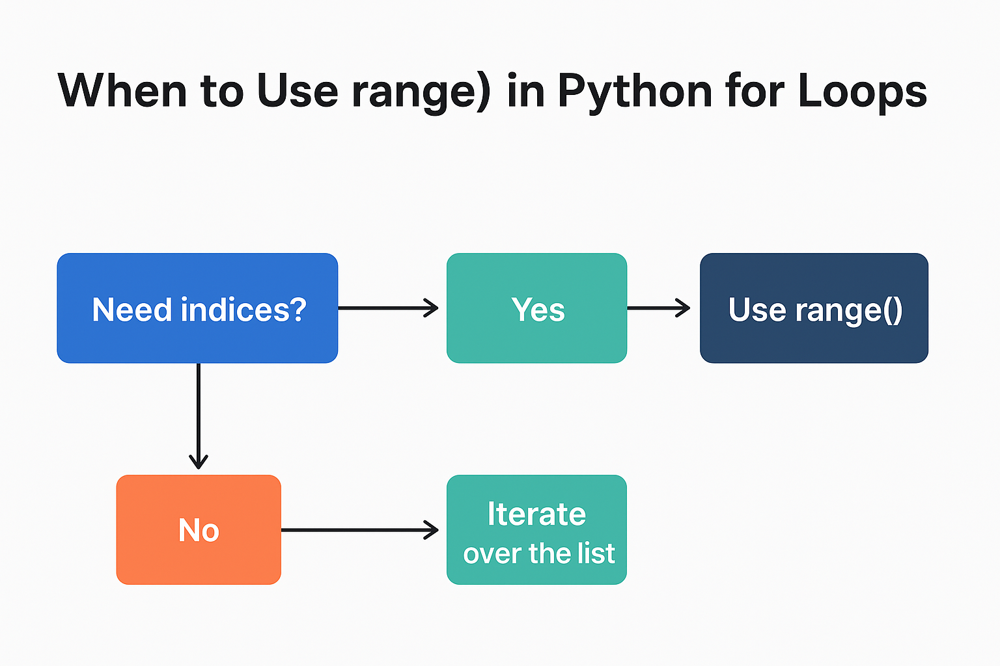

Got it! I’ll rewrite your Python basics scenarios in **beginner-friendly question format**, **explaining when to use `range()` vs a list directly**, and include **tips for using loops, conditions, collections, and built-ins**. I’ll also remove tables and make it more like a **practice Markdown file**.

Here’s the improved version:

---

# Python Basics - Scenario-Based Practice

This document provides **40 beginner-friendly scenarios** to practice **Python basics**, including loops, conditions, collections, and common built-in functions. Each scenario includes an explanation, when to use certain constructs, and a coding example.

---

## 1. For Loops

**Tip:**

* Use `for x in list` when you already have a list of items you want to iterate over.
* Use `for i in range(start, stop, step)` when you want to iterate over **numbers**, especially if you need indices or a specific numeric range.

**Scenarios:**

1. Print all student names in a class

```python
students = ['Alice', 'Bob', 'Charlie']
for name in students:
    print(name)
```

> Use this when you have a **predefined list of items**.

2. Count how many numbers in a list are even

```python
nums = [2, 5, 6, 7, 8]
count = 0
for n in nums:
    if n % 2 == 0:
        count += 1
print(count)
```

3. Print each character of a word

```python
word = "Python"
for c in word:
    print(c)
```

4. Sum the first 50 natural numbers

```python
total = 0
for i in range(1, 51):  # Use range when you want numbers from 1 to 50
    total += i
print(total)
```

5. Print items with index

```python
tasks = ['Task1', 'Task2', 'Task3']
for i, task in enumerate(tasks, 1):
    print(i, task)
```

> Use `enumerate()` when you want both the **index and value**.

---

## 2. While Loops

**Tip:** Use `while` loops when the number of iterations is **unknown** or depends on a **condition** being met.

1. Ask user for input until they type `'exit'`

```python
inp = ''
while inp != 'exit':
    inp = input("Enter something (type 'exit' to quit): ")
```

2. Countdown from 10 to 1

```python
n = 10
while n > 0:
    print(n)
    n -= 1
```

3. Empty a list

```python
lst = [1,2,3]
while lst:
    lst.pop()
print(lst)
```

4. Guessing game

```python
num = 7
guess = 0
while guess != num:
    guess = int(input("Guess the number: "))
print("Correct!")
```

5. Charge battery to 100%

```python
battery = 0
while battery < 100:
    battery += 10
print("Battery full!")
```

---

## 3. If / Else / Elif

**Tip:** Use `if/elif/else` when you want to **branch code based on conditions**.

1. Check number sign

```python
n = -5
if n > 0:
    print('Positive')
elif n < 0:
    print('Negative')
else:
    print('Zero')
```

2. Pass/fail student

```python
marks = 65
if marks >= 50:
    print('Pass')
else:
    print('Fail')
```

3. Age category

```python
age = 15
if age < 13:
    print('Child')
elif age < 20:
    print('Teen')
else:
    print('Adult')
```

4. Discount based on purchase

```python
price = 70
if price > 100:
    discount = 10
elif price > 50:
    discount = 5
else:
    discount = 0
print(discount)
```

5. Check palindrome

```python
word = 'radar'
if word == word[::-1]:
    print('Yes')
else:
    print('No')
```

---

## 4. Lists

**Tip:** Use **lists** when you want an **ordered, changeable collection**.

1. Store daily temperatures

```python
temps = [23, 25, 22]
```

2. Shopping list add/remove

```python
items = ['Eggs', 'Bread']
items.append('Milk')
items.remove('Eggs')
```

3. Reverse names

```python
names = ['Alice', 'Bob']
print(names[::-1])
```

4. Merge two student lists

```python
list1 = ['Alice', 'Bob']
list2 = ['Charlie']
all_students = list1 + list2
```

5. Max/min scores

```python
scores = [55, 89, 76]
print(max(scores))
print(min(scores))
```

---

## 5. Tuples

**Tip:** Use **tuples** for **fixed, unchangeable data**.

1. Store coordinates

```python
coord = (10, 20)
```

2. Month and days

```python
month = ('Jan', 31)
```

3. Student info fixed

```python
student = (1, 'Alice')
```

4. RGB colors

```python
color = (255, 0, 0)
```

5. Configuration settings

```python
settings = ('High', 'ON')
```

---

## 6. Sets

**Tip:** Use **sets** for **unique items** or **membership checks**.

1. Remove duplicate names

```python
names = ['Alice', 'Bob', 'Alice']
unique_names = set(names)
```

2. Track unique words

```python
text = "hello world hello"
words = set(text.split())
```

3. Check prime membership

```python
primes = {2, 3, 5, 7}
n = 3
if n in primes:
    print("Prime")
```

4. Common friends

```python
friends1 = {'Alice', 'Bob'}
friends2 = {'Bob', 'Charlie'}
common = friends1 & friends2
```

5. Unique user IDs

```python
ids = [1, 2, 2, 3]
user_ids = set(ids)
```

---

## 7. Dictionaries

**Tip:** Use **dicts** for **key-value storage**.

1. Store marks by name

```python
marks = {'Alice': 90, 'Bob': 85}
```

2. Word frequency

```python
words = ['hello', 'world', 'hello']
freq = {}
for w in words:
    freq[w] = freq.get(w, 0) + 1
print(freq)
```

3. Product prices

```python
prices = {'Milk': 50}
```

4. Employee roles

```python
roles = {'John': 'Manager'}
```

5. Country codes

```python
codes = {'US': 1, 'IN': 91}
```

---

## 8. Enumerate

**Tip:** Use `enumerate()` to **get index and value together**.

```python
tasks = ['Task1', 'Task2']
for i, t in enumerate(tasks, 1):
    print(i, t)
```

---

## 9. Zip

**Tip:** Use `zip()` to **combine lists** element-wise.

```python
names = ['Alice', 'Bob']
marks = [90, 85]
for n, m in zip(names, marks):
    print(n, m)
```

---

## 10. itertools

**Tip:** Use `itertools` for **combinatorial tasks** like permutations and combinations.

```python
from itertools import permutations, combinations

people = ['A', 'B']
for p in permutations(people):
    print(p)

menu = ['Pizza', 'Burger']
for c in combinations(menu, 2):
    print(c)
```

---

## 11. functools

**Tip:** Use `functools.reduce()` to **aggregate a list** into a single value.

```python
from functools import reduce
nums = [1, 2, 3, 4]
product = reduce(lambda x, y: x * y, nums)
print(product)
```

---

**Usage Tips for Beginners:**

* Use `range()` in `for` loops when you need **numeric sequences** or indices.
* Use `for x in list` when you have **predefined elements** to iterate.
* Use `while` loops when the **end condition is unknown**.
* Use `enumerate()` when you need **index + value**.
* Use `zip()` to **combine two lists** element-wise.
* Use `set` for **unique items**, `tuple` for **immutable collections**, and `dict` for **key-value pairs**.
* `itertools` and `functools` help with **advanced iterations and reductions**.

---

Yes! In your original and rewritten version, you **covered `max`, `min`**, and in the loops you did `sum` manually with a for loop, but you **didn’t explicitly show Python’s built-in `sum()` function** or some other useful built-ins like `len()`, `sorted()`, `reversed()`, `any()`, `all()`, `abs()`, etc.

Here’s a quick list you could **add to your Markdown under “Built-in Functions”** for beginners:

---

## 12. Useful Built-in Functions

**Tip:** Python has many built-in functions to make common tasks easy.

1. **Sum of numbers in a list**

```python
nums = [1, 2, 3, 4, 5]
total = sum(nums)
print(total)
```

2. **Maximum and minimum**

```python
scores = [55, 89, 76]
print(max(scores))  # 89
print(min(scores))  # 55
```

3. **Length of a list/string**

```python
names = ['Alice', 'Bob', 'Charlie']
print(len(names))  # 3

word = "Python"
print(len(word))   # 6
```

4. **Sorted list**

```python
nums = [5, 2, 9, 1]
print(sorted(nums))  # [1, 2, 5, 9]
```

5. **Reverse a list**

```python
nums = [1, 2, 3]
print(list(reversed(nums)))  # [3, 2, 1]
```

6. **Absolute value**

```python
n = -10
print(abs(n))  # 10
```

7. **Check if any or all elements are True**

```python
lst = [True, False, True]
print(any(lst))  # True
print(all(lst))  # False
```

---

💡 **Tip for beginners:**

* Use `sum()` instead of manually looping and adding numbers.
* `max()` and `min()` work for numbers **and strings** (lexicographical).
* `len()` is the easiest way to get **size of a list, tuple, string, or dict**.
* `sorted()` and `reversed()` give **sorted or reversed copies**; they do **not change the original list** unless you use `list.sort()` or `list.reverse()`.

---
