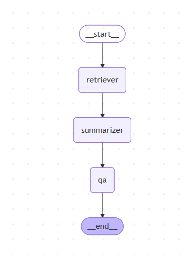

# MultiGent Section
# MultiGent: RAG Multi-Agent Pipeline

This page describes the **RAG (Retrieval-Augmented Generation) Multi-Agent system** built using **LangGraph** and **LangChain**.

---

## Overview

The MultiGent system orchestrates multiple agents to answer questions using external knowledge.  
It consists of three main agents:

1. **Retriever Agent** – fetches relevant documents from a vector store.  
2. **Summarizer Agent** – summarizes the retrieved documents.  
3. **QA Agent** – generates answers based on the summarized context.

---

## Architecture Diagram

The following diagram shows the flow of the multi-agent system:

```mermaid
graph TD
    START --> retriever
    retriever --> summarizer
    summarizer --> qa
    qa --> END



You can add multiple images:
